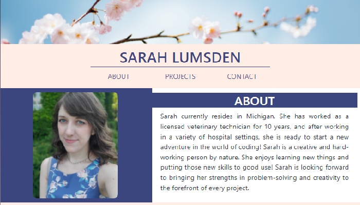

# Sarah Lumsden | Portfolio

## Description
The purpose of this page is to showcase myself and my previous projects, for potential employers, coworkers, or any other person interested in the work I've been doing as I've learned new skills in coding.

## Built With
* HTML
* CSS
* Bootstrap CSS framework

## Website
[Portfolio](https://slumsd01.github.io/portfolio/)

## Contribution
* Base code by [Sarah Lumsden](https://github.com/slumsd01)
* Photo by [Anthony DELANOIX](https://unsplash.com/@anthonydelanoix?utm_source=unsplash&utm_medium=referral&utm_content=creditCopyText) on [Unsplash](https://unsplash.com/?utm_source=unsplash&utm_medium=referral&utm_content=creditCopyText)
